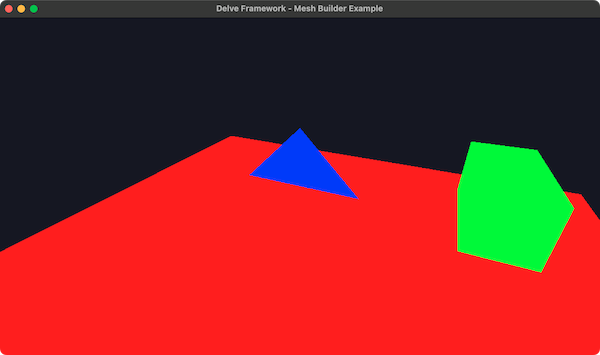

# zig-delve-triangle-study



Tiny example of using [delve](https://github.com/Interrupt/delve-framework) as external library.

Tested with Zig 0.13.0.

## Run

```bash
# debug:
$ zig build run

# release:
$ zig build run --release=fast
```

## LICENSE

- [src/main.zig](src/main.zig) was created by modifying [meshbuilder.zig](https://github.com/Interrupt/delve-framework/blob/3250a6a486277f69c60cb449ffd5540e7cee2309/src/examples/meshbuilder.zig): MIT License - Copyright (c) 2024 Chad Cuddigan ([LICENSE](https://github.com/Interrupt/delve-framework/blob/3f3e9dcc0f418a6338ed17ebadbe5bd68a6227a7/LICENSE))

( This project itself is hereby disclaimed copyrights, to be in the public domain. )
